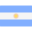

# Contenido del sitio para desarrolladores de Mercado Pago

En este repositorio esta alojado el contenido mostrado en nuestro sitio para desarrolladores, las contribuciones son bienvenidas.

[](https://www.mercadopago.com.ar/developers)
[](https://www.mercadopago.com.br/developers)
[](https://www.mercadopago.com.mx/developers)
[](https://www.mercadopago.com.uy/developers)
[](https://www.mercadopago.com.co/developers)
[](https://www.mercadopago.cl/developers)
[](https://www.mercadopago.com.pe/developers)

## Nomenclatura y Estructura de Carpetas ##

```

    /guides             /payments/api/             introduction     .es     .md 

    ^^^^^^^             ^^^^^^^^^^^^^^            ^^^^^^^^^^^^^     ^^^^    ^^^^
Pagina Principal          Jerarquía               Identificador     Idioma  Formato
                        en el Sidebar             de la Pagina

```

## Para contribuir: ##

1. Hacer un `fork` de este repositorio.
2. Crear un `issue` con una descripción breve sobre la contribución.
3. Seguir la [guia](https://github.com/mercadopago/devsite-docs/wiki/Syntax-guide) para la redacción del contenido.
4. Crear un `pull Request` al `branch` `development`, de preferencia proveer contenido traducido en los lenguajes soportados esto permitirá que tu contribución pueda verse reflejada en el sitio en menor tiempo.
5. El contenido será revisado y comentado por nuestro equipo, puede que te solicitemos algunas correcciones antes de aprobar la contribución.


## ¿En qué puedo contribuir? ##
- **Traducciones**, Los issues pendientes de traduccion serán marcados con el Tag (Missing Translation) para su fácil identificacion.
- **Corrección de estilo**, Si identificas algun error gramatical o el contenido se muestra poco claro y crees que puede ser mejorado, tu ayuda será bien recibida.
- **Corrección de Snippets**, Si identificas algun snippet de código que no está funcionando adecuadamente o no retorna los resultados que se indican en la documentación los ajustes o correcciones son bienvenidos.
- **Reporte de Bugs y contenido deprecado**, Si el contenido que mostramos en el sitio deja de estar actualizado o muestra información no valida, los reportes serán atendidos con prontitud, usar el Tag (Bug) para que sean fáciles de identificar.

## Tengo una idea o sugerencia ##

Crea un issue y usa el Tag (idea) para que pueda ser asignado y atendido.


/ test test