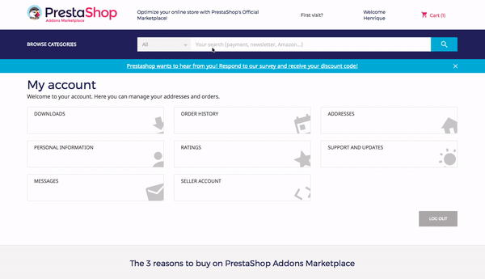
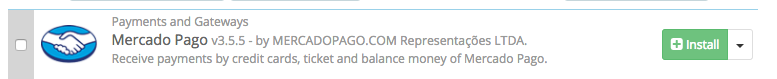
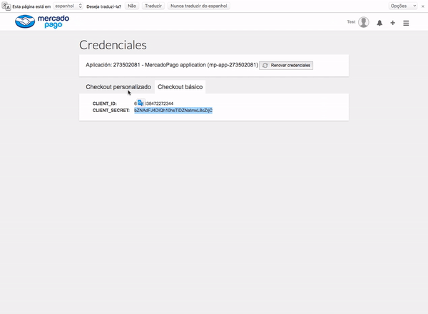
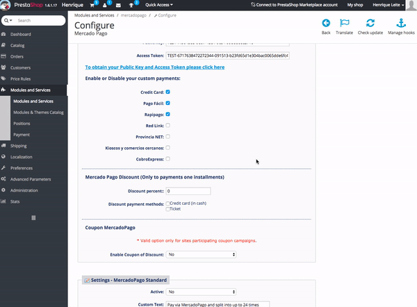

# Prestashop - Mercado Pago Module (v1.6.x to 1.7.x)

* [Requirements](#Requirements)
* [Features](#Features)
* [Installation](#Installation)
* [Upgrade](#Upgrade)
* Checkout Custom
  * [Configure Credit Card and Ticket](#Configure-Credit-Card-and-Ticket)
* Basic Checkout
  * [Configure Checkout Redirect](#Configure-Checkout-Redirect)
  * [Configure Mercado Envios](#Configure-Mercado-Envios)
* [Payment Notification status Settings](#Payment-Notification-status-settings)
* [Support](#Support)

## Requirements: ##

**Prestashop Version**
* Prestashop 1.6.x - 1.7.x

**Environment**
* LAMP (Linux, Apache, MySQL, and PHP)
* LNMP stack

**Operational System**
* Linux x 86
* x86-64

**Web Server**
* Apache 2.x
* Nginx 1.7.x

**Hosting**
* Can execute crontab with PHP 5
* Can override the .htaccess file

**PHP Versions**
* PHP 5.6
* PHP 5.5
* PHP 5.4

**MySQL Version**
* MySQL 5.6 (Oracle or Percona)

**Extension Dependencies**
* PDO_MySQL
* simplexml
* mcrypt
* hash
* GD
* DOM
* iconv
* curl
* SOAP (for Webservices API)

**Additional Settings**
* safe_mode off
* memory_limit maior que 256MB (512MB é o recomendado)

**SSL**
* It is a requirement that you have an SSL certificate.
* During testing in Sandbox you will be able to run at http.

## Features: ##

The module of Mercado Pago to Prestahop is integrated with the features and payment solutions:

* [Basic Checkout (Redirect)](https://www.mercadopago.com.br/developers/en/solutions/payments/basic-checkout/receive-payments/)
    * Split payments (Two cards)
    * [Mercado Envios](https://www.mercadopago.com.br/developers/en/solutions/payments/basic-checkout/receive-payments/)
    * [Refunds of Payments](https://www.mercadopago.com.br/developers/en/solutions/payments/basic-checkout/refund-cancel#refund)

* Custom Checkout
    * [Payment with Credit Card](https://www.mercadopago.com.br/developers/en/solutions/payments/basic-checkout/receive-payments/)
    * [One Click Pay (Customers and Cards)](https://www.mercadopago.com.br/developers/en/solutions/payments/custom-checkout/one-click-charges/javascript/)
    * [Paid with other payment methods](https://www.mercadopago.com.br/developers/en/solutions/payments/custom-checkout/charge-with-other-methods/)
    * [Refunds of Payments](https://www.mercadopago.com.br/developers/en/solutions/payments/custom-checkout/refund-cancel#refund)

* Other features
    * Order update via Cron
    * Customizable success page
    * Installments calculator

## Installation: ##

This process will explain the installation of the Mercado Pago module via Package and Marketplace:

**Installation via Marketplace**

1. Go to **[Prestashop Marketplace](https://addons.prestashop.com/en/payment-card-wallet/23962-mercado-pago.html/)** and click in Register to Download:
2. Before your register, you can download the module.open

3. Now access you admin and go to Modules and Services.

4. Very Good! The module of Mercado Pago was successfully installed.

## Configure Credit Card and Ticket: ##

This process will explain how to configure the module to accept payments with Checkout Custom with Credit Card, Tickets and Standard:

1. After install the module, Go to **Mercado Pago > Configure**, now you need to get your credencials

2. To set up the credentials go to **Mercado Pago - Custom Checkout**, you will see the field **Public Key** and **Access Token**. You can get the credentials at the link:

* Argentina: [https://www.mercadopago.com/mla/account/credentials](https://www.mercadopago.com/mla/account/credentials)
* Brazil: [https://www.mercadopago.com/mlb/account/credentials](https://www.mercadopago.com/mlb/account/credentials)
* Chile: [https://www.mercadopago.com/mlc/account/credentials](https://www.mercadopago.com/mlc/account/credentials)
* Colombia: [https://www.mercadopago.com/mco/account/credentials](https://www.mercadopago.com/mco/account/credentials)
* Mexico: [https://www.mercadopago.com/mlm/account/credentials](https://www.mercadopago.com/mlm/account/credentials)
* Uruguay: [https://www.mercadopago.com/mlu/account/credentials](https://www.mercadopago.com/mlu/account/credentials)
* Venezuela: [https://www.mercadopago.com/mlv/account/credentials](https://www.mercadopago.com/mlv/account/credentials)
* Peru: [https://www.mercadopago.com/mpe/account/credentials](https://www.mercadopago.com/mpe/account/credentials)

> There are two types of credentials:
> * Modo Sandbox: The credentials in this way are used for testing.
> * Modo Produção: The credentials in this way are used to receive payments in production. To use the credentials of the production mode you must complete the form "I want to go to production".

3. Now you can fill the **client id** and **client secret** and click in **Login** Button:

4. Enable custom, fill the **access token** and **public key** and select the options for accept in your custom payment:

5. Enable standard:

 
6. Very good! The Checkout Custom with Credit Card, Ticket and standard has been configured and enabled successfully!
 

## Configure Mercado Envios: ##

This process will explain how to configure the module to accept Mercado Envios:

1. First, You need to enable Mercado Envios in your Mercado Pago account.

	You can do this by accessing, according to your country, the link:

	* Argentina: http://shipping.mercadopago.com.ar/optin/doOptin
	* Brasil: http://shipping.mercadopago.com.br/optin/doOptin
	* Mexico: http://shipping.mercadopago.com.mx/optin/doOptin

> 	IMPORTANT: Your Mercado Pago account must be of type **Seller** and the products needs to have the correct dimensions.

2. To enable the Mercado Envios, go to the page of module and Enable the **Mercado Envios** option and click in **Save**.

5. Very good! The Mercado Envios has been configured and enable successfully!

> 	Youtube:
https://youtu.be/rtXNkdaqUJ8 

## FAQ: ##

Under construction...

## Support: ##

If you have any questions, problems or errors we have a support channel. Send an email to modulos@mercadopago.com with the following information:

* Email of your account Mercado Pago.
* Details about your question, problem or error.
* Files that can help in understanding (Print-Screen, Video, Log Files, etc.).
* Version of Magento.
* Module version, if you are using.

Don't worry... We will help you as soon as possible.